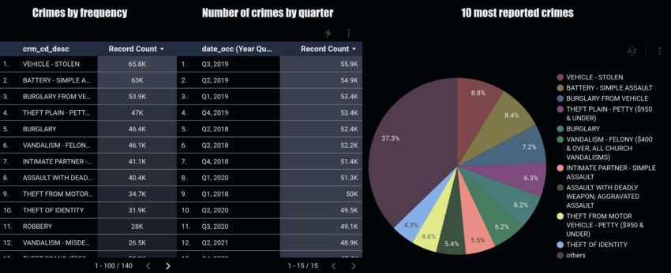
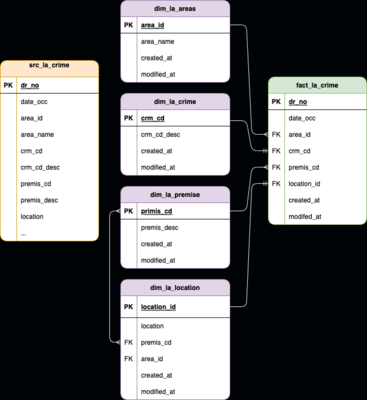
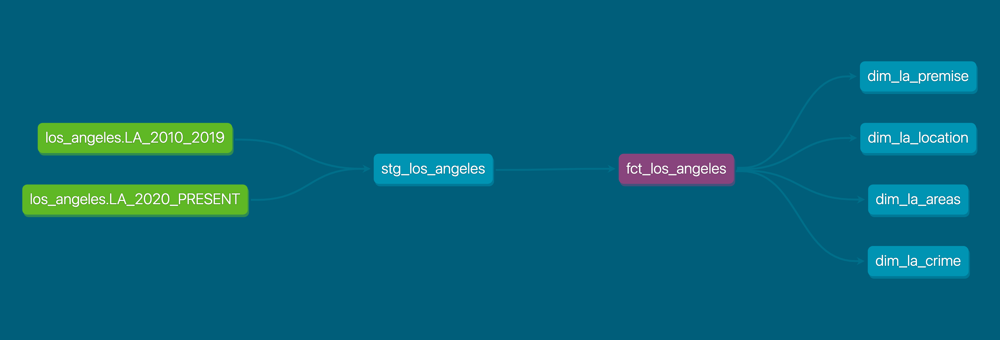

# Los Angeles Crime Analysis

#### By: [Drew White](https://www.linkedin.com/in/drew-riley-white/)

###  _Exploring Crime Los Angeles_

This repository demonstrates the creation of an ELT pipeline in dbt, using city crime data sourced from public kaggle datasets.

### Technologies Used

* Python
* SQL
* BigQuery
* DBT
* Looker Studio

### Dashboards and Visualizations




#### _[Los Angeles Dashboard](https://datastudio.google.com/reporting/5dafe154-fb0b-4188-8836-9249e075aacf)_

### Data Models






### Datasets Used

* https://www.kaggle.com/datasets/chaitanyakck/crime-data-from-2020-to-present

</br>

### Setup/Installation Requirements
* Make new directory:
  ```bash
  mkdir <new-directory>
  cd <new-directory>
  ```
* Clone repository:
  ```bash
  git clone https://github.com/Drewrwhite/la_crime_analysis.git
  ```
* Set up a virtual environment in your terminal:
  ```bash
  python3.7 -m venv venv
  ```
* Activate the environment:
  ```bash
  source venv/bin/activate
  ```
* Install requirements.txt:
  ```bash
	pip install -r requirements.txt
  ```
* Open directory:
  ```bash
  code .
  ```
</br>

## Known Bugs

* No known bugs

<br>

## License

[MIT](./license.txt)

_If you find any issues, please reach out at: **d.white0002@gmail.com**._

Copyright (c) _2023_ _Drew White_


